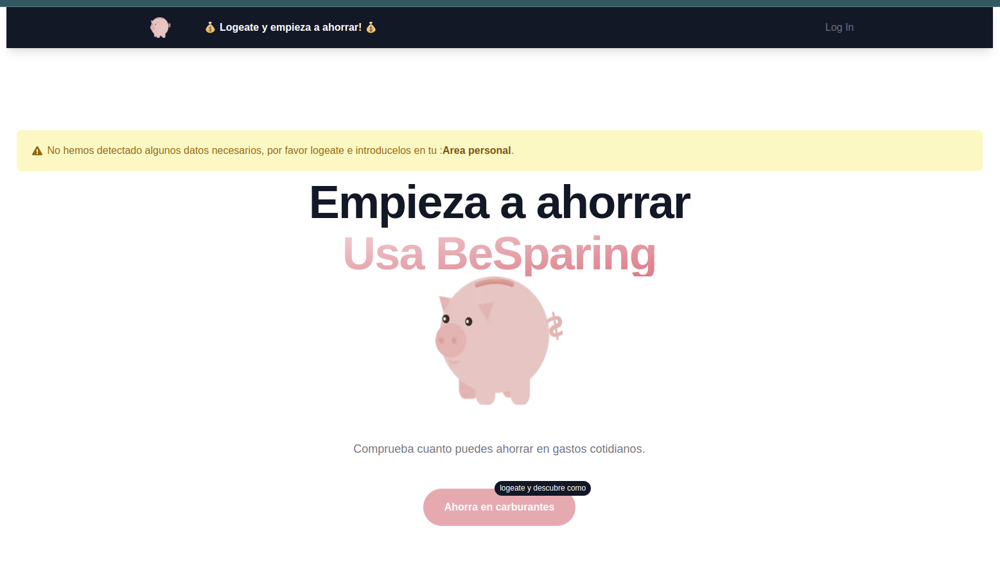
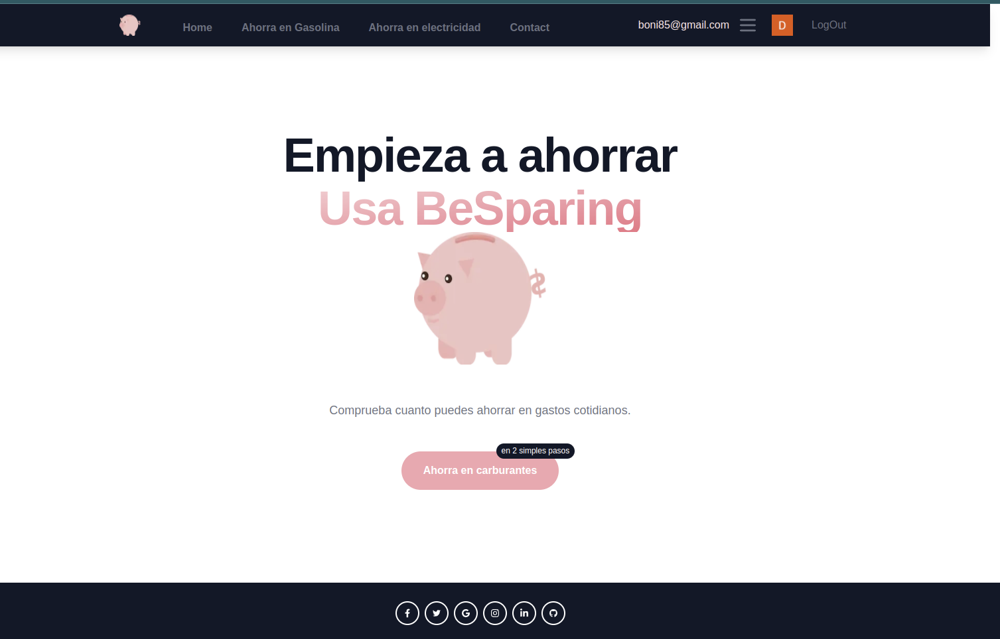
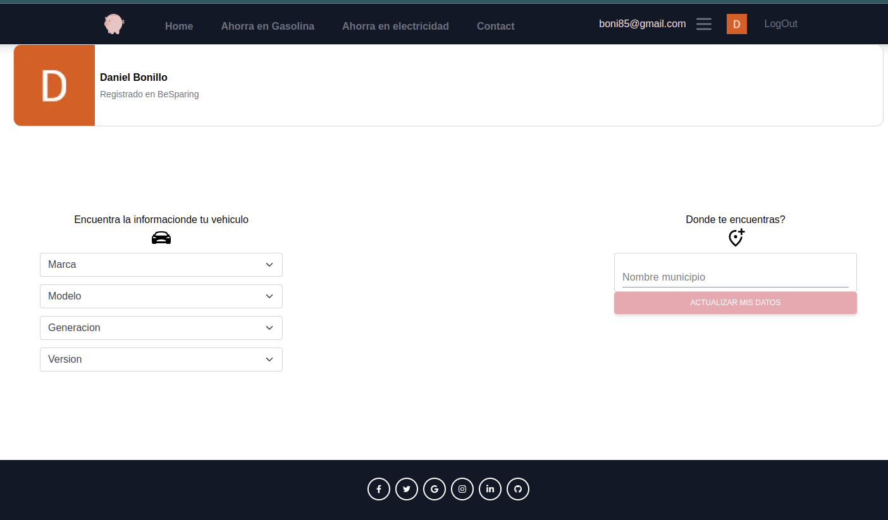
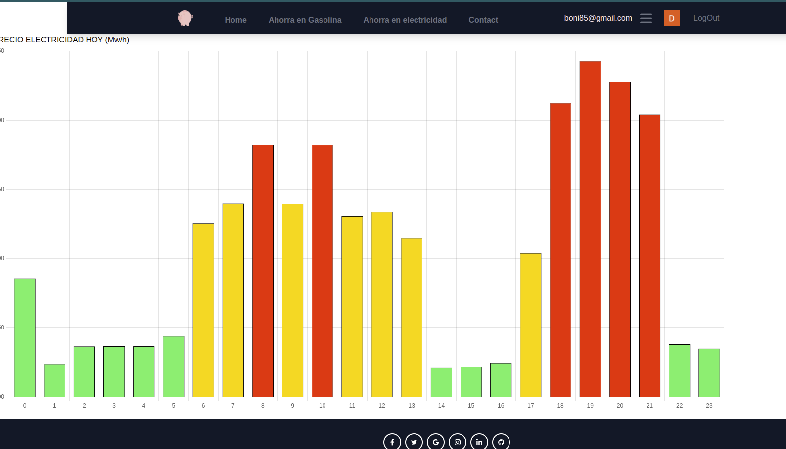
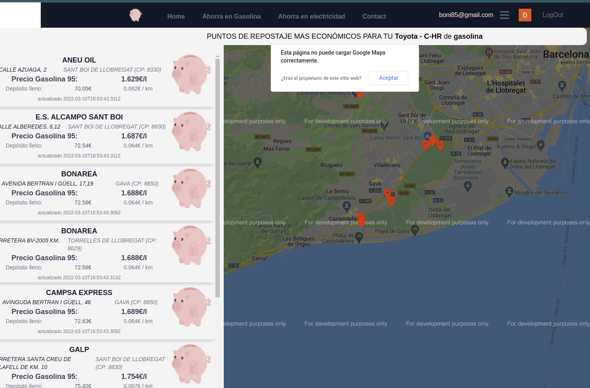
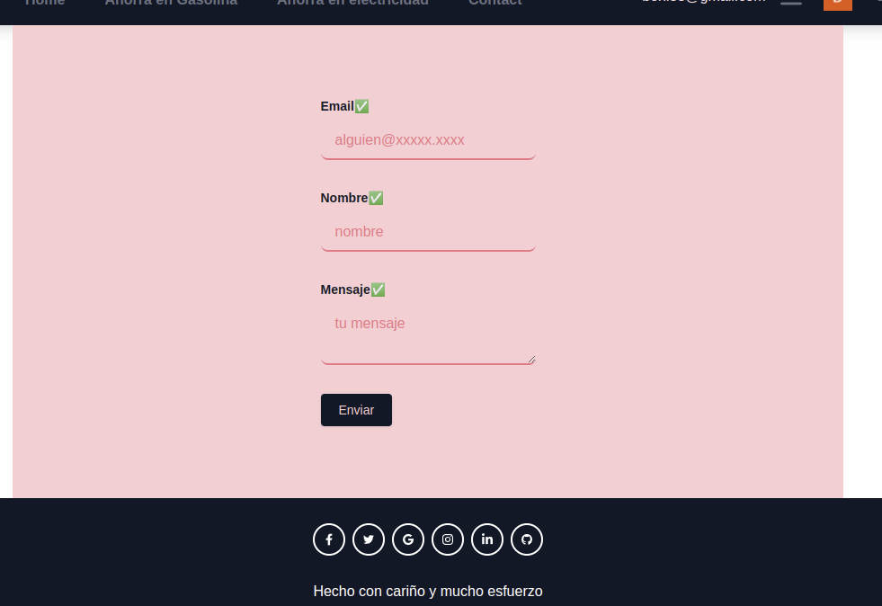
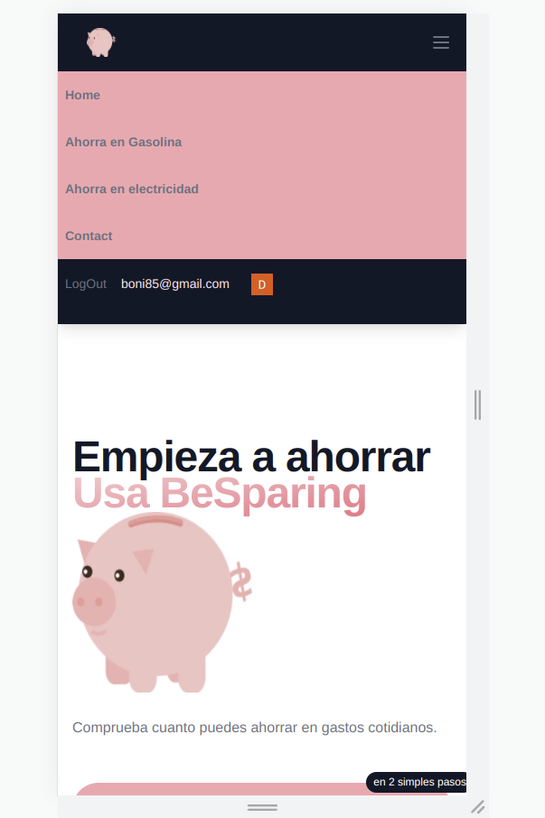

<p align="center">
  <a href="" rel="noopener">
 </a>
</p>

<h3 align="center">BeSparing</h3>

<div align="center">

[]()
[]()
[]()
[](/LICENSE)

</div>

---

<p align="center"> Control your daily expenses, don't waste your money!
    <br> 
</p>

## 📝 Table of Contents

- [About](#about)
- [Getting Started](#getting_started)
- [Deployment](#deployment)
- [Structure](#structure)
- [Usage](#usage)
- [Built Using](#built_using)
- [TODO](../TODO.md)
- [Contributing](../CONTRIBUTING.md)
- [Authors](#authors)
- [Acknowledgments](#acknowledgement)

## 🧐 About <a name = "about"></a>

Particularly, in Spain the price of energy has become highly expensive in recent times.
Given this situation and wanting to carry out a "useful" project at the end of my training, I decided to implement BeSparing, a platform idea to be able to consult some basic data of certain everyday savings-oriented products.

## 🏁 Getting Started <a name = "getting_started"></a>

These instructions will get you a copy of the project up and running on your local machine for development and testing purposes. See [deployment](#deployment) for notes on how to deploy the project on a live system.

### Prerequisites

What things you need to install the software and how to install them.

```
Node 16.x
```

### Installing

A step by step series of examples that tell you how to get a development env running.
To start both fron and api, we just need:

```
yarn init
yanr install
yarn run dev

```

in each of the folders of the different services

## 🎈 PROJECT STRUCTURE <a name="structure"></a>

```
finalProject
├─ .eslintrc.json
├─ .gitignore
├─ README.md
├─ imgs
├─ packages
│  ├─ api
│  │  ├─ src
│  │  │  ├─ app.ts
│  │  │  ├─ config.ts
│  │  │  ├─ feed
│  │  │  │  ├─ getGasolineras.ts
│  │  │  │  ├─ writeAut.ts
│  │  │  │  ├─ writeCPs.ts
│  │  │  │  ├─ writeCars.ts
│  │  │  │  ├─ writeMun.ts
│  │  │  │  └─ writeProv.ts
│  │  │  ├─ lib
│  │  │  │  └─ dbConnect.ts
│  │  │  ├─ models
│  │  │  │  ├─ autonomia.model.ts
│  │  │  │  ├─ car.model.ts
│  │  │  │  ├─ cp.model.ts
│  │  │  │  ├─ gasolinera.model.ts
│  │  │  │  ├─ municipio.model.ts
│  │  │  │  ├─ point.model.ts
│  │  │  │  ├─ provincia.model.ts
│  │  │  │  └─ userData.model.ts
│  │  │  ├─ server.ts
│  │  │  └─ utils
│  │  │     └─ functions.ts
│  └─ front
│     ├─ components
│     │  ├─ Footer.tsx
│     │  ├─ Landing.tsx
│     │  ├─ Userinfo.tsx
│     │  ├─ carSelector
│     │  │  ├─ CascadeSelector.tsx
│     │  │  ├─ ItemSelect.tsx
│     │  │  └─ TarjetaCar.tsx
│     │  ├─ electricidad
│     │  │  └─ ElectDataProvider.tsx
│     │  ├─ forms
│     │  │  ├─ ContactForm.tsx
│     │  │  └─ UpdateCar.tsx
│     │  ├─ map
│     │  │  ├─ Cabecera.tsx
│     │  │  ├─ Card.tsx
│     │  │  ├─ Card_old.tsx
│     │  │  ├─ List.tsx
│     │  │  ├─ Mapa.tsx
│     │  │  └─ locate.ts
│     │  ├─ navbar
│     │  │  ├─ LoginButton.tsx
│     │  │  ├─ MenuLinks.tsx
│     │  │  ├─ MenuLinksMobile.tsx
│     │  │  ├─ Navbar.tsx
│     │  │  └─ menuItems.tsx
│     │  └─ utils
│     │     ├─ Alert.tsx
│     │     ├─ CheckUser.tsx
│     │     └─ SearchBox.tsx
│     ├─ lib
│     │  ├─ api
│     │  │  ├─ apiReq.ts
│     │  │  ├─ carsRequests.ts
│     │  │  ├─ locRequests.ts
│     │  │  ├─ stationsRequests.ts
│     │  │  └─ usersRequests.ts
│     │  ├─ redux
│     │  │  ├─ stationsStore.ts
│     │  │  ├─ userAtcions.ts
│     │  │  └─ userStore.ts
│     │  └─ swr-fetcher.ts
│     ├─ pages
│     │  ├─ _app.js
│     │  ├─ api
│     │  │  ├─ auth
│     │  │  │  └─ [...auth0].js
│     │  │  ├─ provapi.tsx
│     │  │  └─ userauth.ts
│     │  ├─ contact.tsx
│     │  ├─ electricidad.tsx
│     │  ├─ gasolina.tsx
│     │  ├─ index.tsx
│     │  └─ userPanel.tsx
│     ├─ postcss.config.js
│     ├─ public
│     ├─ static
│     ├─ styles
```

## 🎈 Data Models <a name="usage"></a>

```js
- user
    email: string;
    userId: string;
    cp: number;
    municipio?: string;
    carbData?: {
    capacidad: number;
    consumo: number;
    modelo: '';
    tipo: '';
    };
    eData?: {
      coste: number[];
    };

- car
    marca: string;
    modelo: string;
    generacion: string;
    version: string;
    consumo: number;
    capacidad: number;
    tipo: string;
    estado: string;

- gasolinera
    cp: number;
    direccion: string;
    horario: string;
    localidad: string;
    municipio: string;
    location: iPoint;
    nombre: string;
    gasoleo: number;
    gasolina_95: number;
    gasolina_98: number;
    provincia: string;
    ideess: number;
    idmunicipio: number;
    idprovincia: number;
    idccaa: number;

- autonomia
    codigo: Number,
    nombre: String,

- provincia
    codigo: {type: Number},
    nombre: String,
    aut: { type: Schema.Types.ObjectId, ref: 'Autonomia' },

- municipio
    nombre: String,
    coords: Object,
    prov: { type: Schema.Types.ObjectId, ref: 'Provincia' },
    aut: { type: Schema.Types.ObjectId, ref: 'Autonomia' },

```

## 🎈 API <a name="usage"></a>

Dispondremos de los siguientes endpoints:

CRUD `Comunidades autonomas`:

- `GET /api/aut`: Lista todas las comunidades autonomas
- `GET /api/aut?queryparams(codigo, nombre)`: Detalle de una única comunidad autonoma

CRUD `provincias`:

- `GET /api/prov`: Lista todas las provincias
- `GET /api/prov?queryparams(codigo/nombre)`: Detalle de una única provincia
- `GET /api/prov/porautonomia`: Detalle de una provincias por autonomia

CRUD `municipios`:

- `GET /api/mun`: Lista todas los municipio
- `GET /api/mun/porprovincia?prov`: Municipios por provincia
- `GET /api/mun/porautonomia?aut`: Municipios por autonomia

CRUD `cars`:

- `GET /api/marcas`: Lista todas las marcas
- `GET /api/modelos?marca`: Lista todas los modelos de una marca
- `GET /api/generaciones?marca&modelo`: Lista todas las generaciones de un modelo
- `GET /api/versiones?marca&modelo&generacion`: Lista todas las versionesde una generacion
- `GET /api/onecar?marca&modelo&generacion&version`: Lista un vehiculo.
- `POST /api/update`: Actualiza los datos de un vehiculo
- `POST /api/create`: Crea un nuevo un vehiculo

CRUD `stations`:

- `GET /api/stations?long&lat`: Gasolineras cercanas a un punto.
- `GET /api/stations/cp?cp`: Gasolineras cercanas a un codigo postal.
- `GET /api/stations/autonomia/:id`: Gasolineras en la comunidad autonoma.
- `GET /api/stations/provincia/:id`: Gasolineras en la provincia.
- `GET /api/stations/municipio?nombre`: Gasolineras en un municipio.

CRUD `users`:

- `GET /api/user/find?queryparams(email/_id`: Lista todos los users
- `POST /api/user/add`: Crea un user
- `POST /api/user/update`: Actualiza un user
- `DELETE /api/user/delete/:id_`: Elimina un user [PENDIENTE DE IMPLEMENTAR]

## 🎈 Usage <a name="usage"></a>

<p align="center">
  <a href="" rel="noopener">
 </a>
</p>
<p align="center">
  <a href="" rel="noopener">
 </a>
</p>
<p align="center">
  <a href="" rel="noopener">
 </a>
</p>
<p align="center">
  <a href="" rel="noopener">
 </a>
</p>
<p align="center">
  <a href="" rel="noopener">
 </a>
</p>
<p align="center">
  <a href="" rel="noopener">
 </a>
</p>
<p align="center">
  <a href="" >
 </a>
</p>

## 🚀 Deployment <a name = "deployment"></a>

Puede ser desplegado en cualquier servicion web tipo Heroku, gcp, aws...
Para mas info, seguir las instrucciones de cada uno de ellos.

## ⛏️ Built Using <a name = "built_using"></a>

- [MongoDB](https://www.mongodb.com/) - Database
- [Fastify](https://www.fastify.io/) - Server Framework
- [NodeJs](https://nodejs.org/en/) - Server Environment
- [React](https://es.reactjs.org/) - JavaScript library
- [NextJs](https://nextjs.org/) - React Framework
- [Nodemon](https://nodemon.io/) - Dev utility
- [Typescript](https://www.typescriptlang.org/) - JavaScript with syntax for types
- [ChartJs](https://www.chartjs.org/) - JavaScript charting
- [Redux](https://react-redux.js.org/) - Official React bindings for Redux
- [react-hook-forms](https://react-hook-form.com/) - Performant, flexible and extensible forms
- [tailwindcss](https://tailwindcss.com/) - CSS framework

## ✍️ Authors <a name = "authors"></a>

- [@oobonioo](https://github.com/oOBoniOo) - idea, design and implementation

## 🎉 Acknowledgements <a name = "acknowledgement"></a>

- Thanks to the countless people who teach and share their experience throughout the world and thanks to whom many of the obstacles along the way are solved.
- Infinite thanks to all those who pushed me to get into this world.
-
- y por supuesto gracias a tod al agente de Core por estos 5 meses de aprendizaje.
  [](https://www.corecode.school/)
